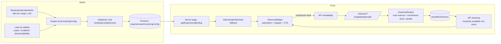

# Fechas y Salidas — Guía completa de implementación (Admin + Front)

Este documento describe cómo está implementada la sección **"Fechas y Salidas"** de las experiencias (el bloque de fechas con cupos dentro de la card **"Reserva / Calendario"** del admin), para poder replicarla en otro sistema similar.

> **Nota:** En el admin de experiencias la sección no se llama literalmente "Fechas y Salidas": vive dentro de la card **"Reserva / Calendario"** y se compone del calendario de alta (`BookingCalendarAdmin`) + la lista de fechas con controles por salida. En **paquetes** sí existe una card llamada "Fechas y Salidas" basada en `SalidasManager`, pero es un modelo distinto (fecha ida/vuelta, ciudad, precio por salida). Esta guía documenta el sistema de **experiencias**.

---

## 1. Visión general

Cada experiencia guarda en su documento de Firestore un objeto `bookingConfig` que contiene:

- Los textos del bloque de reserva (título, subtítulos).
- El listado de **fechas/salidas** (`dates`), cada una con cupo, estado activo/pausada y visibilidad de cupos.
- Configuración comercial: seña (`depositAmount`), moneda, máximo de personas por compra y métodos de pago.

El front muestra un **calendario mensual** donde solo son seleccionables las fechas activas con cupo disponible. La disponibilidad real se calcula con un **ledger de movimientos de stock** (`stockMovimientos`), que es la fuente de verdad; como respaldo se usa el conteo de reservas.



---

## 2. Modelo de datos

### 2.1 Tipos TypeScript

Definidos en [components/landing-reserva/types.ts](../components/landing-reserva/types.ts):

```ts
// Una salida/fecha individual
export type BookingDate = {
  date: string;              // "2026-02-15" (YYYY-MM-DD)
  capacity: number;          // cupos totales cargados para esa fecha
  enabled: boolean;          // salida activa (publicada) o pausada
  showAvailability: boolean; // si el front muestra la cantidad exacta de cupos
};

export type BookingCurrency = 'ars' | 'brl' | 'usd';

export type BookingConfig = {
  enabled: boolean;                 // si false, no se muestra el bloque reserva en el front
  title: string;                    // título del bloque (chip)
  subtitle1: string;                // línea bajo "Elegí tu fecha"
  subtitle2: string;                // microcopy junto al botón de pago
  hasSpecificDates: boolean;        // false = "sin fechas específicas" (se coordina después)
  dates: BookingDate[];             // salidas (solo si hasSpecificDates = true)
  depositAmount: number;            // precio de seña/reserva POR PERSONA
  maxPeoplePerBooking?: number;     // límite por compra; undefined = sin límite visible (techo 50)
  currency: BookingCurrency;
  paymentMethods: { stripe: boolean; pix: boolean };
  referralCommissionMode?: 'experience' | 'vendor';
  referralCommission?: { type: 'percent' | 'fixed'; value: number; currency: BookingCurrency };
};
```

### 2.2 Tipo público (lo que ve el front)

```ts
export type BookingPublicData = {
  enabled: boolean;
  title: string;
  subtitle1: string;
  subtitle2: string;
  hasSpecificDates: boolean;
  // Igual que BookingDate pero con "available" calculado:
  dates: { date: string; capacity: number; available: number; enabled: boolean; showAvailability: boolean }[];
  depositAmount: number;
  maxPeoplePerBooking?: number;
  currency: BookingCurrency;
  paymentMethods: { stripe: boolean; pix: boolean };
};
```

### 2.3 Persistencia (Firestore)

| Colección | Uso |
|---|---|
| `experiencias/{id}` | Documento principal. El campo `bookingConfig` guarda todo el bloque. Se escribe con `stripUndefined()` (Firestore no acepta `undefined`) y timestamps `fechaCreacion` / `updatedAt`. |
| `stockMovimientos` | Ledger de movimientos por `(experienceId, date)`. Tipos: `entrada`, `salida`, `ajuste`, `reserva`. Las compras registran `type: 'reserva'` con `quantity: -people`. |
| `reservas` | Reservas con `experienceId`, `date` (YYYY-MM-DD o `"sin-fecha"`), `people`, `status`, etc. |

**Funciones de datos** en [lib/experiencias.ts](../lib/experiencias.ts):

- `createExperiencia(payload)` / `updateExperiencia(id, payload)` — escriben el doc (con `stripUndefined`).
- `getExperienciaBySlug(slug)` — lectura para el front.
- `toBookingPublicData(exp, reservedByDate?)` — convierte `bookingConfig` a `BookingPublicData`: filtra fechas con formato inválido, **ordena ascendente**, normaliza moneda y calcula `available = max(0, capacity - reserved)`. Si el doc es **legacy** (sin `bookingConfig`), migra desde `availableDates` (capacity 1 por fecha), `calendarIntro`, `reservationMicrocopy`, `price` y `maxPeople`.

**Stock** en [lib/stock.ts](../lib/stock.ts):

```ts
getStockDisponible(experienceId, date, baseCapacity): number
// = max(0, baseCapacity + Σ quantity de movimientos de esa fecha)
```

**Conteo de reservas** en [lib/reservas.ts](../lib/reservas.ts) (`getReservasCountByExperienceAndDate`): suma `people` por fecha de reservas con status `reserved | boarded | rescheduled | completed` (excluye canceladas y `no_show`, e ignora `sin-fecha`).

---

## 3. Validación (Zod)

Schema `bookingConfigSchema` en [lib/schemas/booking.ts](../lib/schemas/booking.ts):

```ts
const bookingDateSchema = z.object({
  date: z.string().regex(/^\d{4}-\d{2}-\d{2}$/, 'Formato YYYY-MM-DD'),
  capacity: z.number().int().min(0),
  enabled: z.boolean(),
  showAvailability: z.boolean().default(false),
});
```

Reglas de negocio validadas (`.refine`):

1. **Al menos un método de pago** activo (stripe o pix).
2. **No se permiten fechas duplicadas** (cuando `hasSpecificDates = true`).
3. **Capacity mínimo 1 si la fecha está habilitada** (`!d.enabled || d.capacity >= 1`).

En el admin, antes de guardar se normaliza: `depositAmount >= 0`, `maxPeoplePerBooking` clampeado a `1..50`, moneda forzada a `ars | brl | usd`. Se valida con `safeParse` y se muestran los errores con `toast.error`.

---

## 4. Admin — Creación y edición

Archivos:

- Creación: [app/admin/experiencias/nuevo/page.tsx](../app/admin/experiencias/nuevo/page.tsx)
- Edición: [app/admin/experiencias/[id]/page.tsx](../app/admin/experiencias/[id]/page.tsx)
- Calendario de alta: [components/admin/BookingCalendarAdmin.tsx](../components/admin/BookingCalendarAdmin.tsx)

Ambas páginas usan `react-hook-form` + Zod para los campos planos, pero **`bookingConfig` se maneja con `useState` propio** (fuera del form), porque es un objeto anidado con lista editable.

### 4.1 Estado y helpers (idénticos en crear y editar)

```tsx
const [bookingConfig, setBookingConfig] = useState<BookingConfig>(defaultBookingConfig);
const [newDateCapacity, setNewDateCapacity] = useState(1);      // cupo por defecto para altas
const [datesVisibleCount, setDatesVisibleCount] = useState(10); // paginación de la lista

// Siempre que cambia, re-ordena las fechas ascendente por ISO
const updateBookingConfig = (updater: (prev: BookingConfig) => BookingConfig) => {
  setBookingConfig((prev) => {
    const next = updater(prev);
    const dates = [...next.dates].sort((a, b) => a.date.localeCompare(b.date));
    return { ...next, dates };
  });
};

const removeBookingDate = (index)        => /* filtra por índice */;
const removeBookingDateByDate = (date)   => /* filtra por date */;
const updateBookingDate = (index, field, value) => /* setea un campo de una fecha */;

// Alta masiva: genera TODAS las fechas entre Desde y Hasta con el mismo cupo,
// sin duplicar las existentes.
const addDateRange = (from: string, to: string, capacity: number) => { ... };

// Formato de label: "viernes, 15 de febrero de 2026"
function formatDateLabelAdmin(iso: string): string { ... }
function todayIso(): string { ... } // YYYY-MM-DD local (para minDate)
```

`defaultBookingConfig` inicial: `enabled: true`, `hasSpecificDates: true`, `dates: []`, `depositAmount: 0`, `paymentMethods: { stripe: true, pix: false }`. Ojo con la moneda por defecto: **`'ars'` en creación y `'brl'` en edición** (decisión de negocio de este proyecto; al replicar, unificá según tu caso).

### 4.2 Carga inicial en edición

```ts
function bookingConfigFromExperience(exp: Experience): BookingConfig
```

- Si el doc tiene `bookingConfig`: normaliza (`showAvailability` a boolean, ordena fechas, moneda válida, `depositAmount` con fallback a `exp.price`, `maxPeoplePerBooking` con fallback a `exp.maxPeople`).
- Si es **legacy**: migra desde `availableDates` (cada fecha con `capacity: 1, enabled: true, showAvailability: false`).

Además, la edición carga los **reservados por fecha** para mostrar ocupación:

```ts
const [reservedByDate, setReservedByDate] = useState<Record<string, number>>({});
useEffect(() => {
  if (!id) return;
  getReservasCountByExperienceAndDate(id).then(setReservedByDate);
}, [id]);
```

Y ordena la lista dejando **las fechas pasadas al final** (futuras asc, pasadas desc):

```ts
const datesForList = bookingConfig.dates
  .map((d, index) => ({ ...d, index }))
  .sort((a, b) => {
    const aIsPast = a.date < today;
    const bIsPast = b.date < today;
    if (aIsPast !== bIsPast) return aIsPast ? 1 : -1;
    return aIsPast ? b.date.localeCompare(a.date) : a.date.localeCompare(b.date);
  });
```

> En edición las operaciones se hacen **por índice real** (`d.index`), porque el orden visible ya no coincide con el del array.

### 4.3 Componente `BookingCalendarAdmin` (alta de fechas)

Componente controlado con props:

```ts
type Props = {
  dates: BookingDate[];
  defaultCapacity: number;
  onAddDate: (date: string, capacity: number) => void;
  onRemoveDate: (date: string) => void;
  onAddRange: (from: string, to: string, capacity: number) => void;
  minDate?: string; // default: hoy
};
```

**UI y lógica:**

1. **Calendario mensual** (grilla 7 columnas, semana empieza en lunes: `(first.getDay() + 6) % 7`). Navegación con botones mes anterior/siguiente. Los días pasados (`iso < minDate`) se deshabilitan.
2. **Selección de rango con clics**: primer clic = `Desde`, segundo clic = `Hasta` (si es anterior, se invierten), tercer clic = reinicia con nuevo `Desde`. Los días del rango se pintan con `bg-primary/20`, los extremos con `bg-primary` + ring, y las fechas ya cargadas en verde agua (`bg-(--sherpa-green-water)`).
3. **Bloque "Agregar rango"**: inputs `type="date"` Desde/Hasta + "Cupos por día" (1..999) + botón. El botón llama `onAddRange(from, to, capacity)` y resetea la selección. Solo se habilita si ambas fechas son válidas y `from <= to`.

Las fechas se manejan como **strings ISO `YYYY-MM-DD` locales** (helper `toIso` con `getFullYear/getMonth/getDate`, no `toISOString`, para evitar corrimientos por zona horaria).

Conexión desde la página:

```tsx
<BookingCalendarAdmin
  dates={bookingConfig.dates}
  defaultCapacity={newDateCapacity}
  onAddDate={(date, capacity) => {
    if (bookingConfig.dates.some((d) => d.date === date)) return; // sin duplicados
    updateBookingConfig((prev) => ({
      ...prev,
      dates: [...prev.dates, { date, capacity, enabled: true, showAvailability: false }],
    }));
    toast.success('Fecha agregada');
  }}
  onRemoveDate={(date) => { removeBookingDateByDate(date); toast.success('Fecha quitada'); }}
  onAddRange={addDateRange}
  minDate={todayIso()}
/>
```

> Toda fecha nueva nace con `enabled: true` y `showAvailability: false`.

### 4.4 Lista de salidas configuradas

Debajo del calendario:

- **Estado vacío**: ícono `Calendar` + textos "Aún no hay fechas" / "Agregá al menos una fecha con cupos...".
- **Contador**: "N fechas configuradas (mostrando X)".
- **Caja de ayuda**: "Gestioná/Control visual por salida — Cada fecha se gestiona de forma independiente...".
- **Items** (`<ul>`), cada uno una card redondeada con:
  - Ícono calendario + label largo (`formatDateLabelAdmin`, capitalizado) + ISO chico debajo.
  - Badge **"Fecha activa"** (emerald) / **"Fecha pausada"** (slate).
  - Badge **"Cupos visibles"** (sky) / **"Cupos ocultos"** (amber).
  - Botón eliminar (`Trash2`, rojo).
  - Grilla de controles:

  | Control | Creación | Edición |
  |---|---|---|
  | **Cupos del día** | `Input type=number min=0` | igual |
  | **Reservados** | — | número (de `reservedByDate`) |
  | **Disponibles** | — | `max(0, capacity - reservados)` |
  | **Vista de cupos** | `Switch` → `showAvailability` | igual |
  | **Estado de la salida** | `Switch` → `enabled` | igual |

  Grid: `md:grid-cols-3` en creación; `md:grid-cols-2 xl:grid-cols-[minmax(240px,1.5fr)_repeat(4,minmax(0,1fr))]` en edición.

- **Paginación**: se muestran de a 10 (`datesVisibleCount`), con botones "Ver más (N restantes)" (+10) y "Ver menos" (vuelve a 10).

### 4.5 Toggle "Sin fechas específicas"

```tsx
<Switch
  checked={!bookingConfig.hasSpecificDates}
  onCheckedChange={(checked) => updateBookingConfig((prev) => ({ ...prev, hasSpecificDates: !checked }))}
/>
```

Si está activo, **no se renderiza** ni el calendario ni la lista (`{bookingConfig.hasSpecificDates && (...)}`), y el front permite reservar sin elegir fecha (el checkout usa `date=sin-fecha`).

### 4.6 Guardado

En `onSubmit`:

1. Se normaliza `bookingConfig` (seña ≥ 0, clamp de `maxPeoplePerBooking`, moneda válida).
2. `bookingConfigSchema.safeParse(...)` → si falla, `toast.error` con todos los mensajes y **aborta**.
3. Check extra: al menos un método de pago.
4. Se arma el `payload: ExperienceInput` con `bookingConfig: parsed.data` y se llama `createExperiencia` / `updateExperiencia`.
5. `revalidateFrontPaths(['/experiencias', '/experiencias/{slug}'])` para refrescar el front (ISR).

---

## 5. Front

### 5.1 Página pública (server)

[app/experiencias/[slug]/page.tsx](../app/experiencias/[slug]/page.tsx): Server Component con `revalidate = 3600` (ISR 1h), `generateStaticParams` con experiencias visibles, y `generateMetadata` para OG. Renderiza `<LandingReservaPage experienceProp={experience} />`.

### 5.2 `LandingReservaPage` (client) — fallback + polling

[components/landing-reserva/LandingReservaPage.tsx](../components/landing-reserva/LandingReservaPage.tsx):

1. Calcula **fallback síncrono** con `toBookingPublicData(experienceProp)` (sin reservas descontadas: `available = capacity`). Esto garantiza que el calendario pinte algo aunque la API tarde.
2. Hace `fetch` a `GET /api/experiencias/{slug}/booking` (con `cache: 'no-store'`):
   - al montar,
   - **cada 30 segundos** (`setInterval`),
   - al volver a la pestaña (`visibilitychange`),
   - con `AbortController` para cancelar fetches superpuestos.
3. `bookingData = bookingDataFromApi !== undefined ? bookingDataFromApi : fallbackBookingData`.
4. Renderiza `<ReservaWidget>` solo si `!bookingData || bookingData.enabled`.

### 5.3 API `GET /api/experiencias/[slug]/booking`

[app/api/experiencias/[slug]/booking/route.ts](../app/api/experiencias/[slug]/booking/route.ts) (`runtime: nodejs`, `force-dynamic`, header `Cache-Control: no-store`):

1. `getExperienciaBySlug(slug)` → 404 si no existe.
2. `reservedByDate = getReservasCountByExperienceAndDate(experience.id)`.
3. `booking = toBookingPublicData(experience, reservedByDate)`.
4. **Recalcula `available` con el ledger de stock** (autoridad): para cada fecha, `getStockDisponible(experience.id, date, baseCapacity)`; si falla, deja el valor por conteo de reservas.
5. Devuelve `{ booking }`.

### 5.4 `ReservaWidget` — el calendario del usuario

[components/landing-reserva/ReservaWidget.tsx](../components/landing-reserva/ReservaWidget.tsx). Layout de 2 columnas (`lg:grid-cols-[1.1fr_0.9fr]`):

**Columna izquierda — "Paso 1: Elegí tu fecha"**

- Mapa de fechas seleccionables:

```ts
const availableDatesMap = useMemo(() => {
  if (!hasSpecificDates || !bookingData?.dates?.length) return null;
  const map = new Map<string, number>();
  for (const d of bookingData.dates) {
    if (d.enabled && d.available > 0) map.set(d.date, d.available);
  }
  return map;
}, [hasSpecificDates, bookingData?.dates]);
```

- **Reglas de seleccionabilidad** (`isDateSelectable`):
  1. Si `hasSpecificDates = false` → nada seleccionable (se muestra aviso "Sin fechas específicas — coordinamos la fecha después").
  2. El **día de hoy no es seleccionable** (`dayStart <= today`).
  3. **Mañana solo hasta las 22:00** (`isTomorrow && currentHour >= 22` → no).
  4. Debe existir en `availableDatesMap` (activa + con cupo).

- **Calendario mensual**: misma grilla que el admin (semana desde lunes), con navegación. Estados visuales por día: no seleccionable (gris), seleccionable (verde claro con borde), seleccionado (`bg-success` blanco). Animaciones con framer-motion (`whileHover`, `whileTap`).
- **Badge de cupos por día** (solo si `showAvailability === true` para esa fecha, el día es futuro y no aplica la restricción de las 22:00): `"N cupos"` / `"Agotado"`, con colores: ≤2 rojo, ≤5 amarillo, resto verde.
- Al seleccionar fecha (`handleDateSelect`): guarda un **hold de 10 minutos** (`holdExpiresAt`) y lo persiste en `sessionStorage` (`booking_hold_{slug}`); se muestra countdown `MM:SS`.

**Columna derecha — "Paso 2: Tu reserva"**

- Card "Valor total del tour" (`experiencePrice × people`, si hay precio).
- Fecha seleccionada + countdown del hold.
- **Stepper de personas** (− / +): mínimo 1; máximo = `min(maxPeoplePerBooking ?? 50, available de la fecha elegida)`. Si la fecha tiene `showAvailability`, muestra "Quedan N cupos". Si hay límite, chip "Máximo X personas".
- Card "Monto a pagar ahora" = `depositAmount × people` (formateado por moneda: ARS `$`, BRL `R$`, USD `USD`).
- Botón **"Continuar al pago"** (`canCheckout`): con fechas específicas requiere fecha seleccionada y válida; sin fechas, siempre habilitado. Microcopy configurable (`subtitle2`).

**Verificación y navegación al checkout** (`handleCheckout`):

1. Si hay fecha, llama `GET /api/experiencias/{slug}/availability?date=YYYY-MM-DD&people=N`; si `data.ok === false` muestra "No hay cupo suficiente... Disponible: X".
2. Navega a `/checkout?slug={slug}&people={N}&date={YYYY-MM-DD|sin-fecha}` (propaga `?ref` de referido si existe en la URL).

### 5.5 API `GET /api/experiencias/[slug]/availability`

[app/api/experiencias/[slug]/availability/route.ts](../app/api/experiencias/[slug]/availability/route.ts): devuelve `{ available, ok: people <= available }` usando `getStockDisponible` con el `capacity` base de esa fecha en `bookingConfig.dates`.

### 5.6 Checkout y descuento de stock

- [app/checkout/page.tsx](../app/checkout/page.tsx): normaliza `date` (si la experiencia no tiene fechas específicas → `'sin-fecha'`; valida regex `YYYY-MM-DD`).
- [app/api/checkout/finalize/route.ts](../app/api/checkout/finalize/route.ts): en una **transacción** crea la `reserva` (status `reserved`) y, si `date !== 'sin-fecha'`, el movimiento de stock:

```ts
{ experienceId, date, type: 'reserva', quantity: -people, author: 'system',
  referenceId: session.id, baseCapacityAtThatTime: baseCapacity, ... }
```

También guarda un `capacitySnapshot` (baseCapacity, maxPeoplePerBooking, hasSpecificDates, enabled) para auditoría. Los mismos movimientos los registran los flujos de reserva manual del admin/vendedor ([app/api/admin/reservas/route.ts](../app/api/admin/reservas/route.ts), [app/api/vendor/reservas/route.ts](../app/api/vendor/reservas/route.ts)) y ajustes desde [app/api/admin/stock/route.ts](../app/api/admin/stock/route.ts).

---

## 6. Guía paso a paso para replicarlo en otro sistema

### Paso 1 — Tipos y schema
1. Definí `BookingDate` y `BookingConfig` (podés recortar campos: lo mínimo es `dates`, `hasSpecificDates`, `enabled`).
2. Definí `BookingPublicData` = `BookingConfig` + `available` por fecha.
3. Creá el schema Zod con las 3 reglas (método de pago, sin duplicados, capacity ≥ 1 si enabled).

### Paso 2 — Capa de datos
4. Persistí `bookingConfig` dentro del documento de la entidad (experiencia/producto). Sanitizá `undefined` antes de escribir en Firestore.
5. Implementá `toBookingPublicData(entity, reservedByDate?)` con orden ascendente, filtro de fechas inválidas y cálculo de `available`.
6. (Opcional pero recomendado) Implementá el ledger de stock: colección de movimientos con `quantity` firmada y `getStockDisponible(id, date, baseCapacity)`.

### Paso 3 — Admin
7. Estado `bookingConfig` con `useState` + helper `updateBookingConfig` que **siempre re-ordena** las fechas.
8. Copiá `BookingCalendarAdmin` (calendario mensual + selección de rango por 2 clics + bloque "Agregar rango"). Claves: strings ISO locales, `minDate = hoy`, días pasados deshabilitados, no duplicar.
9. Implementá `addDateRange` (loop día a día con `setDate`, saltando existentes).
10. Lista de fechas: badges de estado, input de cupos, switches `enabled`/`showAvailability`, eliminar, paginación de a 10. En edición: sumar columnas Reservados/Disponibles y ordenar pasadas al final (actualizando por índice real).
11. Toggle "Sin fechas específicas" que oculte calendario y lista.
12. En el submit: normalizar → `safeParse` → toast de errores → guardar → revalidar rutas del front.

### Paso 4 — APIs públicas
13. `GET /api/.../booking`: arma el `BookingPublicData` con disponibilidad real (stock o conteo de reservas), `Cache-Control: no-store`.
14. `GET /api/.../availability?date&people`: chequeo puntual previo al checkout.

### Paso 5 — Front
15. Página server que trae la entidad y pasa el fallback (`toBookingPublicData` sin reservas) al client.
16. Client: fetch inicial + polling cada 30 s + refetch al volver a la pestaña, con `AbortController`.
17. Widget de reserva: calendario mensual con las 4 reglas de seleccionabilidad (no hoy, mañana hasta 22:00, enabled, available > 0), badges de cupos condicionados por `showAvailability`, stepper de personas con tope `min(maxPeople, available)`, monto = seña × personas, hold de 10 min con countdown, y botón que verifica disponibilidad antes de ir al checkout.

### Paso 6 — Checkout
18. Normalizar `date` (`sin-fecha` cuando corresponda) y validar formato.
19. Al confirmar el pago, en transacción: crear reserva + movimiento de stock `quantity: -people` + `capacitySnapshot` para auditoría.

---

## 7. Checklist de reglas de negocio

- [ ] Toda fecha nueva nace con `enabled: true`, `showAvailability: false`.
- [ ] No se permiten fechas duplicadas (UI y schema).
- [ ] Fecha habilitada requiere `capacity >= 1`; pausada puede tener 0.
- [ ] El admin nunca permite cargar fechas pasadas (`minDate = hoy`).
- [ ] El front no deja elegir: hoy, mañana después de las 22:00, fechas pausadas o sin cupo.
- [ ] `available` se muestra solo si `showAvailability = true` (y respeta la regla de las 22:00).
- [ ] Disponibilidad = `capacity` + Σ movimientos de stock (ledger), con fallback a conteo de reservas (`reserved | boarded | rescheduled | completed`).
- [ ] Al pagar: reserva + movimiento `type: 'reserva'`, `quantity: -people`, en transacción.
- [ ] `hasSpecificDates = false` → checkout con `date = 'sin-fecha'` y sin validación de cupo por fecha.
- [ ] APIs públicas con `no-store`; admin guarda y revalida las rutas afectadas (ISR).

---

## 8. Mapa de archivos

| Responsabilidad | Archivo |
|---|---|
| Tipos `BookingDate` / `BookingConfig` / `BookingPublicData` | [components/landing-reserva/types.ts](../components/landing-reserva/types.ts) |
| Schema Zod | [lib/schemas/booking.ts](../lib/schemas/booking.ts) |
| CRUD + `toBookingPublicData` + migración legacy | [lib/experiencias.ts](../lib/experiencias.ts) |
| Stock (ledger) | [lib/stock.ts](../lib/stock.ts) |
| Conteo de reservas por fecha | [lib/reservas.ts](../lib/reservas.ts) |
| Admin creación | [app/admin/experiencias/nuevo/page.tsx](../app/admin/experiencias/nuevo/page.tsx) |
| Admin edición | [app/admin/experiencias/[id]/page.tsx](../app/admin/experiencias/[id]/page.tsx) |
| Calendario de alta (admin) | [components/admin/BookingCalendarAdmin.tsx](../components/admin/BookingCalendarAdmin.tsx) |
| Página pública (server) | [app/experiencias/[slug]/page.tsx](../app/experiencias/[slug]/page.tsx) |
| Orquestador landing (fallback + polling) | [components/landing-reserva/LandingReservaPage.tsx](../components/landing-reserva/LandingReservaPage.tsx) |
| Widget de reserva (front) | [components/landing-reserva/ReservaWidget.tsx](../components/landing-reserva/ReservaWidget.tsx) |
| API datos de reserva | [app/api/experiencias/[slug]/booking/route.ts](../app/api/experiencias/[slug]/booking/route.ts) |
| API verificación puntual | [app/api/experiencias/[slug]/availability/route.ts](../app/api/experiencias/[slug]/availability/route.ts) |
| Checkout (normalización de fecha) | [app/checkout/page.tsx](../app/checkout/page.tsx) |
| Finalización (reserva + stock) | [app/api/checkout/finalize/route.ts](../app/api/checkout/finalize/route.ts) |
| Doc de la estructura bookingConfig | [docs/EXPERIENCIA-BOOKING-CONFIG.md](EXPERIENCIA-BOOKING-CONFIG.md) |
| Doc de stock | [docs/STOCK-AND-BLOB.md](STOCK-AND-BLOB.md) |
